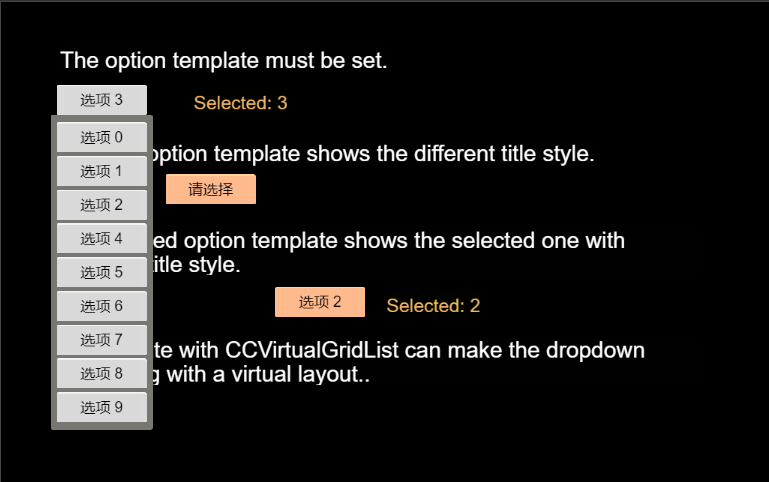
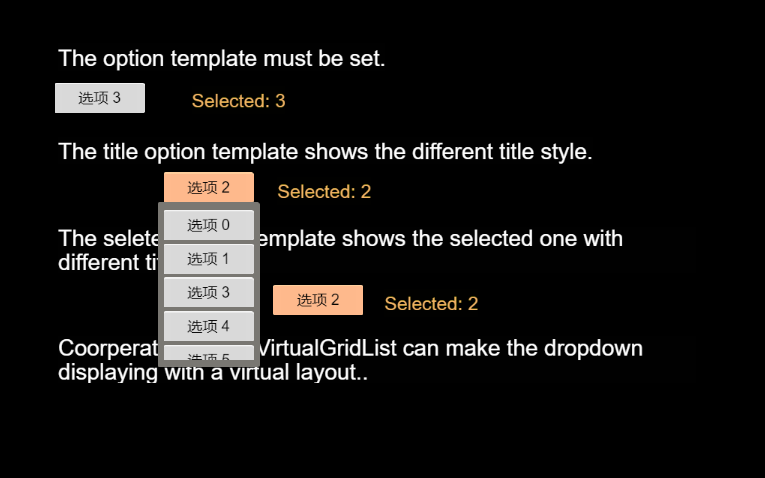
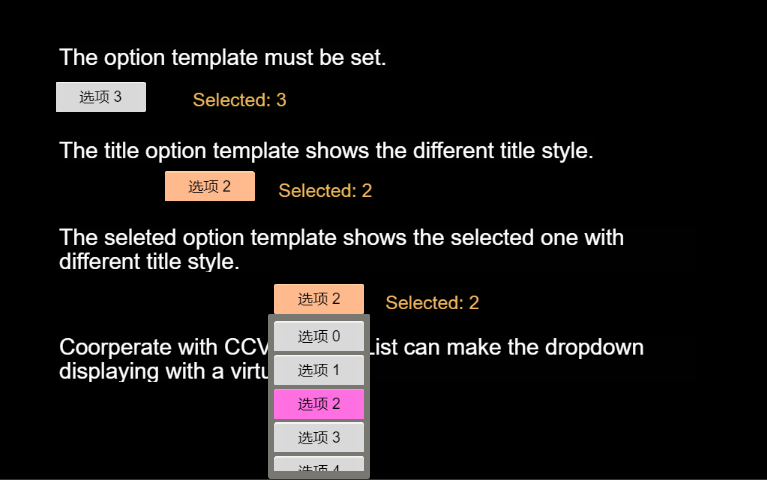

# 一 控件介绍    
针对Cocos Creator，上新一个小型好用的下拉列表控件，动画平滑，设置多样，数据驱动，点击空白收起，可扩展虚拟列表。

Cocos Creator 引擎中没有提供一款拿来即用的下拉列表控件，参考多种情景考虑，设计实现了这款小型但极其实用的下拉列表控件，拿来即用，配置灵活。

# 二 控件安装
使用控件非常简单，只需要拷贝demo项目中两个文件 ButtonDropdownList.prefab, ButtonDropdownList.js 到您的工程中的prefabs文件夹中即可。实用前，将ButtonDropdownList.prefab 拖入画布中就可以。

# 三 API说明

## 1. ButtonDropdownList 启动参数
启动参数可以在creator 图形化界面填入，但是为了不受预制体的维护影响，建议通过初 始化脚本接口传入启动参数。

### buttonDropdownList.initDropdownList(optionButtonTemplate, options, titleButtonTemplate, selectedOptionButtonTemplate)
### 参数
```
- optionButtonTemplate: cc.Prefab   选项按钮模板(Button)
- options? {                   
        placeHolder?: String               当placeholder为空的时候，默认选项为列表第一个
        hideSelectedOption?: Boolean        打开列表的时候，当前选中的选项是否在列表中显示 默认为true
        paddingLeftAndRight?: Number        下拉框两侧边距 默认为5
        paddingTopAndBottom?: Number        下拉框上下边距 默认为5
        spacingY?: Number                   选项之间间隙 默认为3
        marginTop?: Number                  下拉列表距标题按钮距离 默认为0
        maxListHeight?: Number              列表限高 默认为0：不限制高度
        listBackground?: cc.SpriteFrame     下拉列表背景图片
        optionButtonSize?: cc.Size          下来选项按钮大小
    }
- titleButtonTemplate?: cc.Prefab   头部按钮模板(Button)，如果不设置，默认使用optionButtonTemplate
- selectedOptionButtonTemplate?: cc.Prefab  列表中选中的按钮模板(Button)，如果不设置，默认使用optionButtonTemplate,只有当 hideSelectedOption = false 的时候有效
```
### 初始化demo
```
initDropdownList(){
    let dropdownListController = this.dropdownList.getComponent("ButtonDropdownList");
    dropdownListController.initDropdownList(this.optionButtonTemplate, {
        placeHolder: '请选择',
        paddingLeftAndRight: 8,
        paddingTopAndBottom: 10,
        spacingY: 5,
        marginTop: 0,
        hideSelectedOption: true,
        optionButtonSize: new cc.size(120, 40)
    });

    let dataList = [];
    for(let i = 0; i < 10; i++){
        dataList.push({
            key: i +'',
            label: '选项 ' + i
        });
    }
    this._dataList1 = dataList;
    dropdownListController.addSelectionChangedEventHandler((selectionData)=>{
        this.lbSelection1.string = 'Selected: '+ selectionData.key;
    }, this);
    dropdownListController.setOptionDataList(dataList, '1');
}
```
### 只设置 optionButtonTemplate，所有按钮一样


### 设置头部按钮样式 titleButtonTemplate


### 设置头部按钮样式 titleButtonTemplate 和 选中按钮样式 selectedOptionButtonTemplate


## 2. ButtonDropdownList 功能接口

### getOptionDataList(): any[]
获取下拉列表数据 [{key, label}]

### getSelectKey(): String
获取当前选中的key

### setSelection(key: String, triggerEvent: Boolean): void
设定选中选项。key代表选中选项的key值，triggerEvent代表是否触发选项变更事件 默认 false

### addSelectionChangedEventHandler(handler: Function, thisObj: any): void
注册选项变更事件处理方法，如果注册了此事件，则不会触发emit(ButtonDropdownList.Events.SELECTTION_CHANGED)。handler(selectionData)为选项修改回调函数， thisObj回调函数的this对象

### setOptionDataList(dataList: any[], selectedKey: String): void
初始化下拉列表数据。dataList 为下拉列表数据 [{key, label}]， selectedKey为下拉列表默认选项

### reset(): void
重置控件，列表收起。

# 四 下拉列表虚拟布局扩展
理论简单，配合[CCVirtualGridList](https://github.com/SituDana/CCVirtualGridList-for-Cocos-Creator)控件，将按钮列表容器listContent替换成CCVirtualGridList，源码少量改动。
